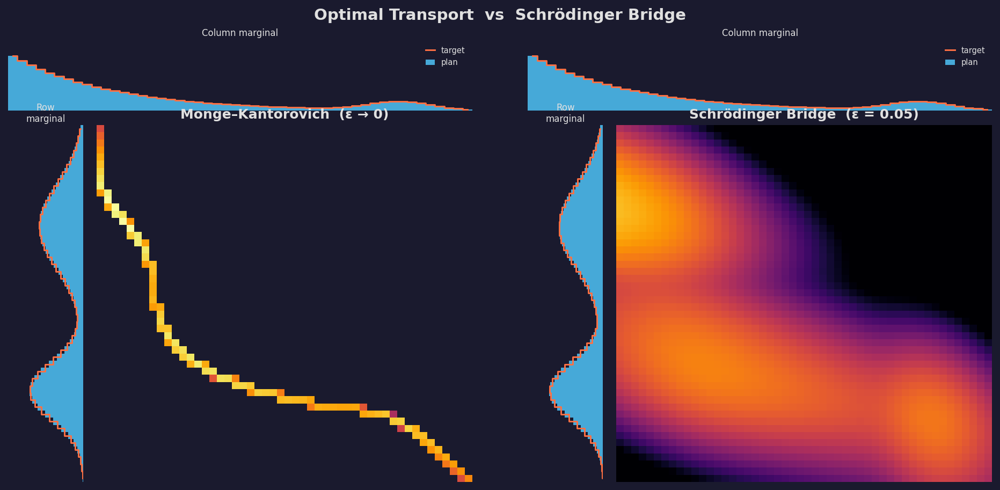
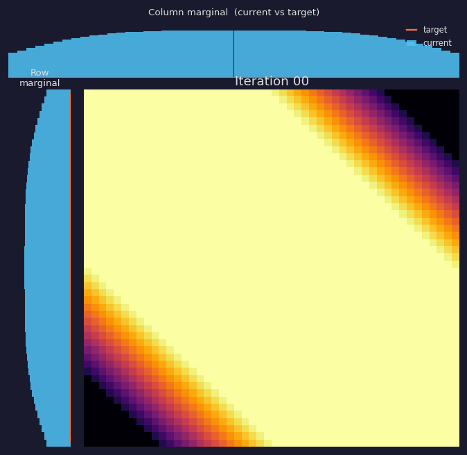
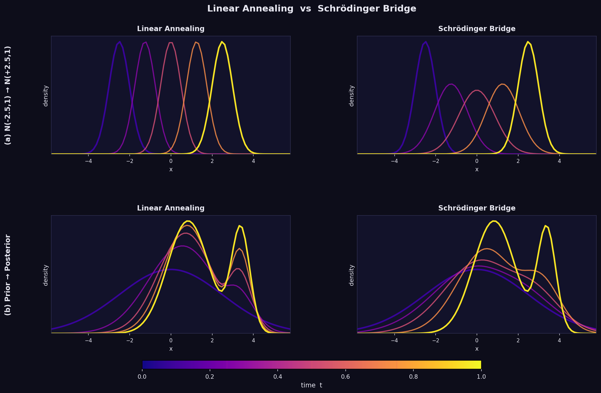

## Overview {.smaller}

1. **Motivation** — why care about Schrödinger Bridges?
2. **Brownian Bridge** — the building block
3. **Multiple Particles** — mixtures of Brownian bridges
4. **Unknown Pairings** — a Bayesian perspective
5. **Many Particles** — deriving the KL objective
6. **The Schrödinger Bridge Problem** — formal statement
7. **Connection to Diffusion Models**
8. **Solving the SB Problem** — Sinkhorn and beyond
9. **MCMC Simulation**
10. **Conclusion**

---

## Motivation {.smaller}

::: {.columns}
::: {.column width="60%"}
- **Diffusion models** have become the dominant paradigm in generative modelling
- Standard approach: run a forward diffusion until it reaches a **known prior**, then learn the reverse
- A key question: *how long is long enough?*
- **Schrödinger Bridges** provide a principled answer: find the diffusion that satisfies **exact marginal constraints in finite time**
:::
::: {.column width="40%"}
Key references:

- Ho et al. (2020) — DDPM
- Song & Ermon (2019) — score-based
- De Bortoli et al. (2021) — Diffusion SB
:::
:::

---

## Brownian Bridge — Setup

- Consider a particle starting at $X_0 = a$ undergoing **standard Brownian motion**
- Conditioning on $X_0 = a$, the marginal at time $t$ is
$$X_t \mid X_0 = a \sim \mathcal{N}(a,\, t)$$
- Now additionally observe the **endpoint** $X_1 = b$
- Question: what is the distribution of $X_t \mid X_0 = a, X_1 = b$?

---

## Brownian Bridge — Derivation

By the **Markov property**, $X_1 \mid X_t \sim \mathcal{N}(X_t,\, 1-t)$, so

$$\begin{pmatrix} X_t \\ X_1 \end{pmatrix} \Bigg| X_0 = a
\;\sim\; \mathcal{N}\!\left(
  \begin{pmatrix} a \\ a \end{pmatrix},\;
  \begin{pmatrix} t & t \\ t & 1 \end{pmatrix}
\right)$$

Conditioning on $X_1 = b$ (via the Schur complement):

$$\boxed{X_t \mid X_0 = a,\; X_1 = b \;\sim\; \mathcal{N}\!\left(ta + (1-t)b,\; t(1-t)\right)}$$

- **Linear drift** interpolating $a \to b$
- **Variance** $t(1-t)$ is symmetric — peaks at $t = \tfrac{1}{2}$

---

## Brownian Bridge — Visualisation

:::{.center-text}
{width=70%}
:::

---

## Multiple Independent Particles {.smaller}

- Now consider $N$ particles, each **independently** following Brownian motion
- We observe all starting positions $a_1, \ldots, a_N$ and endpoints $b_1, \ldots, b_N$
- Each particle traverses its own Brownian bridge:
$$X^i_t \mid X^i_0 = a_i,\; X^i_1 = b_i \;\sim\; \mathcal{N}(ta_i + (1-t)b_i,\; t(1-t))$$
- The **collective density** at time $t$ is a **mixture of Gaussians**

> This is the key building block — the Schrödinger Bridge is a *weighted* version of exactly this.

---

## Unknown Pairings — Setting

- Suppose we observe starting positions $\{a_i\}$ and ending positions $\{b_j\}$, but **we don't know which particle is which**
- How should we pair them?
- **Approach**: place a **uniform prior** over all permutations $\pi$, then condition on the observed displacements

The **Brownian likelihood** for pairing $(a_i, b_j)$ is
$$\mathcal{L}(a_i, b_j) \propto \exp\!\left(-\tfrac{1}{2}(a_i - b_j)^2\right)$$

---

## Unknown Pairings — Posterior

The posterior over pairings $(\mathbf{i}, \mathbf{j})$ is

$$p(\mathbf{i}, \mathbf{j}) \propto \prod_{(i,j)} \exp\!\left(-\tfrac{1}{2}(a_i - b_j)^2\right)$$

**Connection to cross-entropy**: let $q$ be the empirical transport measure and $r(i,j) \propto \exp(-\tfrac{1}{2}(a_i-b_j)^2)$ be the reference. Then

$$\log p(\mathbf{i}, \mathbf{j}) = -N \cdot H(q, r)$$

For large $N$ it concentrates near the **minimiser of cross-entropy**

---

## Many Particles — Setting {.smaller}

::: {.columns}
::: {.column width="55%"}
- Scale up: $M$ particles at each of $N$ locations — total $MN$ particles
- Track the **fraction** $Q_{ij}$ = fraction starting at $a_i$ ending at $b_j$
- Marginal constraints: each row and column of $Q$ must sum to $\tfrac{1}{N}$
- Key distinction: **microstate** (which particle goes where) vs **macrostate** ($Q$ matrix)
:::
::: {.column width="45%"}
Number of microstates for a given $Q$:
$$\frac{(NM)!}{\displaystyle\prod_{i,j}(NM Q_{ij})!}$$
This is a **multinomial coefficient** — the entropy factor.
:::
:::

---

## Many Particles — Stirling's Approximation {.smaller}

Using Stirling's approximation on $\log p(Q)$:

$$\log p(Q) = NM\bigl(H(q) - H(q, r)\bigr) + \text{const}$$

$$= -NM \cdot \mathrm{KL}(q \,\|\, r) + \text{const}$$

As $M \to \infty$:

$$Q^* = \arg \min \mathrm{KL}(q \,\|\, r)$$

We have derived the **principle of maximum entropy** from first principles, and discovered the **Schrödinger Bridge**.

---

## The Schrödinger Bridge Problem

> **Definition.** Given marginals $\mu$ and $\nu$ on $\mathcal{X}$, the (static) Schrödinger Bridge is the joint distribution $Q^*$ on $\mathcal{X} \times \mathcal{X}$ that:
>
> 1. Satisfies $X_0 \sim \mu$ and $X_1 \sim \nu$
> 2. Minimises $\mathrm{KL}(Q \,\|\, R)$, where $R$ is the **reference Brownian motion**

The reference is $R(x_0, x_1) \propto \exp\!\left(-\tfrac{1}{2}(x_0-x_1)^2\right)$.

Once $Q^*$ is found, the path distribution is a **mixture of Brownian bridges** with weights given by the transport plan.

---

## Connection to Optimal Transport {.smaller}

:::{.center-text}
{width=80%}
:::

::: {.small}
The KL objective is an **entropy-regularised** Monge-Kantorovich problem. The Brownian variance $\sigma^2$ controls the regularisation strength. As $\sigma^2 \to 0$, the SB collapses to the deterministic OT plan.
:::

---

## Schrödinger Bridge and Diffusion Models {.smaller}

Traditional diffusion models:

1. Choose a forward diffusion with a known **stationary distribution** (the prior)
2. Run until **approximately** stationary
3. Learn the **backwards process** (i.e. the score)

::: {.fragment}
**Problem**: step 2 requires trusting convergence — no finite-time guarantee.

**Solution via SB**: instead of hoping for convergence, find the diffusion process that is *closest* to Brownian motion while **exactly** satisfying the marginal constraints at $t=0$ and $t=1$.

> The SB forces the forward dynamics to reach the prior **in finite time**.
:::

---

## Solving the SB: Sinkhorn Algorithm

For **finite** support, the solution is elegant:

1. Initialise $Q$ at the reference distribution $R$
2. **Rescale rows** to satisfy the $X_0 \sim \mu$ marginal
3. **Rescale columns** to satisfy the $X_1 \sim \nu$ marginal
4. Repeat until convergence

::: {.fragment}
(Sinkhorn 1964): this converges to the minimum-KL solution!

It is equivalent to **coordinate ascent in the dual problem**.
:::

---

## Sinkhorn in Action {.smaller}

:::{.center-text}
{width=40%}
:::

::: {.small}
Each frame alternates between row and column rescaling. The transport plan gradually satisfies both marginal constraints while minimising KL to the reference.
:::

---

## Scaling Up: DeBortoli et al. (2021) {.smaller}

Sinkhorn is **infeasible** for continuous distributions, high dimensions, large datasets.

**Key idea**: model the conditional distributions as **diffusion processes** instead of explicit matrices.

Algorithm (DSBM — Diffusion SB Matching):

1. Initialise at data distribution; use reference for **forward dynamics**
2. **Learn backward dynamics** by sampling data, propagating forward
3. **Learn forward dynamics** by sampling prior, propagating backward under learned reverse
4. Repeat

> This is a **continuous Sinkhorn algorithm** where each conditional distribution is parameterised by a neural SDE.

---

## Annealing vs Schrödinger Bridge

:::{.center-text}
{width=80%}
:::

::: {.small}
Annealing follows geometric interpolation of densities (may pass through low-probability regions). The Schrödinger bridge instead follows the **most probable Brownian paths** between the marginals.
:::

---

## MCMC Simulation

For a **finite particle system**, we can simulate the posterior over transport plans directly using Metropolis-Hastings.

**Key observation**: swapping the endpoints of two particles changes the energy by
$$\Delta E = (x_i - y_j)^2 + (x_j - y_i)^2 - (x_i - y_i)^2 - (x_j - y_j)^2$$

The MH acceptance ratio is $\min(1,\, e^{-\Delta E / \varepsilon})$.

**Algorithm**: alternates between sweeping **bit-masked swaps** (to explore efficiently) and **random-pairing shuffles** (for global moves).

---

## Bit-Flip MH Algorithm {.smaller}

::: {.small}
**Input**: $M = 2^N$ particles $(x_i, y_i)$, regularisation $\varepsilon > 0$

**Repeat**:

- **For each bit** $b \in \{0, \ldots, N-1\}$, for each pair $(i, j = i \oplus 2^b)$:
  - Compute $\Delta E = (x_i - y_j)^2 + (x_j - y_i)^2 - (x_i - y_i)^2 - (x_j - y_j)^2$
  - Accept swap with probability $\min(1,\; e^{-\Delta E/\varepsilon})$

- After a full $N$-bit cycle, draw random permutation $\sigma$ and propose **random-pair swaps** via MH

- **Toggle phase**: alternate between swapping $y$-values and swapping $x$-values
:::

::: {.fragment}
**Correctness**: each swap proposal is reversible; each phase preserves the empirical marginal of the swapped coordinate. The target is **log-concave**, so multimodality is not an issue.
:::

---

## Demo

:::{.center-text}
[zach-lau.github.io/STAT547E-Project/code/particle_sim.html](https://zach-lau.github.io/STAT547E-Project/code/particle_sim.html)
:::

- Visualises the MCMC algorithm in real time in the browser

---

## Conclusion {.smaller}

We built up the Schrödinger Bridge problem from first principles:

| Building block | Key idea |
|---|---|
| Brownian Bridge | Conditional diffusion, $\mathcal{N}(ta+(1-t)b,\; t(1-t))$ |
| Multiple particles | Mixture of Gaussians |
| Unknown pairings | Uniform prior + Brownian likelihood → cross-entropy |
| Many particles | Stirling → KL divergence, entropy regularisation |
| SB problem | Minimise $\mathrm{KL}(Q \| R)$ subject to marginals |
| Sinkhorn | Iterated marginal rescaling = coordinate ascent in dual |
| DSBM | Neural SDE parameterisation of Sinkhorn |
| MCMC | Bit-flip MH on finite particle system |

---

## References {.smaller}

::: {.small}
- **Ho et al. (2020)**. Denoising Diffusion Probabilistic Models. *NeurIPS*.
- **Song & Ermon (2019)**. Generative Modeling by Estimating Gradients of the Data Distribution. *NeurIPS*.
- **De Bortoli et al. (2021)**. Diffusion Schrödinger Bridge with Applications to Score-Based Generative Modeling. *NeurIPS*.
- **Schrödinger (1932)**. Sur la théorie relativiste de l'électron et l'interprétation de la mécanique quantique. *Ann. Inst. Henri Poincaré*.
- **Sinkhorn (1964)**. A Relationship Between Arbitrary Positive Matrices and Doubly Stochastic Matrices. *Ann. Math. Statist.*
- **Léonard (2013)**. A survey of the Schrödinger problem and some of its connections with optimal transport. *Discrete Contin. Dyn. Syst.*
:::
